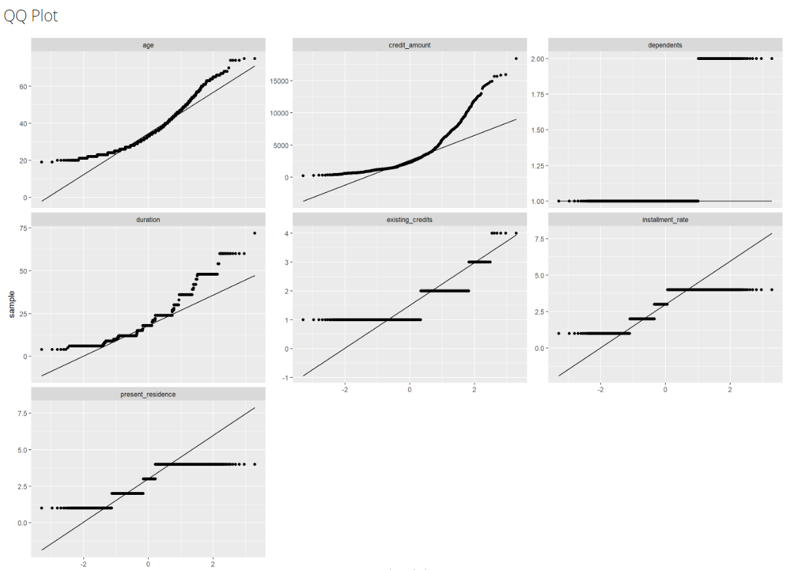
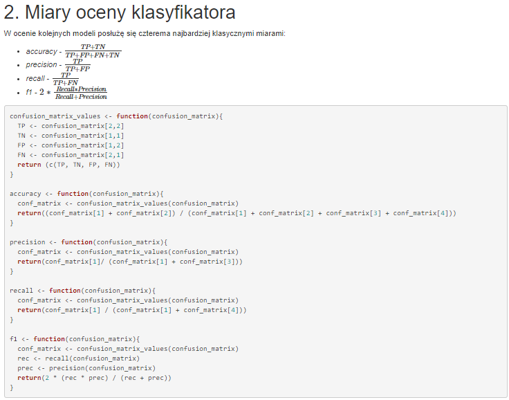
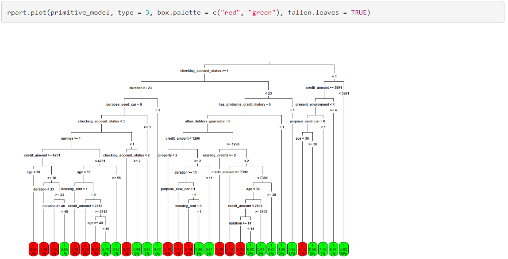
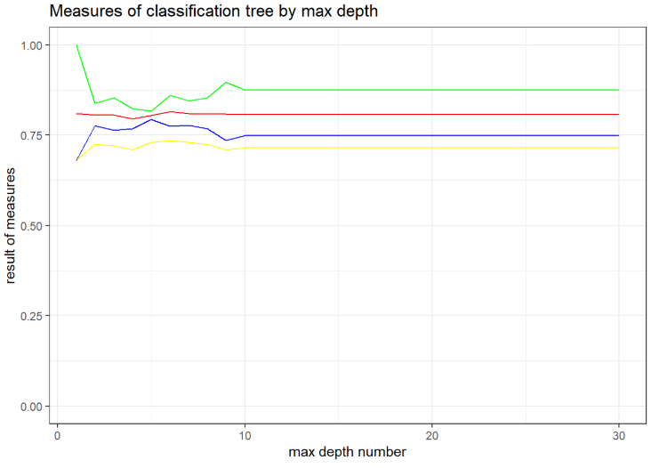
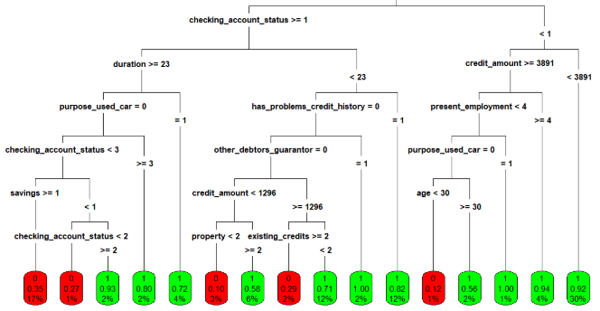
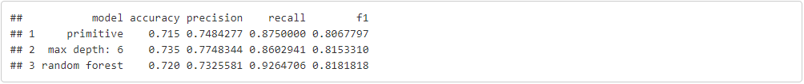

```{r setup, include=FALSE}
knitr::opts_chunk$set(echo = TRUE)
```

# 1. Ogólnie

**German credit data** to bardzo ładny zbiór danych pod naukę uczenia maszynowego. Jest on względnie nieduży, gdyż zawiera 1000-czną próbkę osób ubiegających się o kredyt, jednak jest przy tym wydaje się reprezentatywny (dane zdają się dobrze odzwierciedlać populację) i zawiera dużo informacji na temat każdego klienta.

W ciągu ostatnich tygodni pierwszorzędnie dobrze zapoznaliśmy się z daną ramką danych, następnie przygotowaliśmy ją pod odpalania algorytmów machine learning, żeby na końcu wybrać ten jeden fajny model i go przetestować.

# 2. Czyszczenie

Pierwotna wersja data frame nie była najweselsza na świecie - zamiast ludzkich liczb czy jasnych wartości typu faktor, mieliśmy do czynienia z chaosem w postaci **dziwnych oznaczeń** takich jak widać na załączonym obrazku:


Z pomocą przyszła **dokumentacja**, która rozwiała wszelkie możliwości. W celu dalszej pracy z naszymi danymi, podmieniliśmy skrótowe identyfikatory na ciągi znaków przyjazne użytkownikowi.


Końcowy efekt zaprezentował się następująco:


Wielkim szczęściem okazał się za to fakt, że nasza ramka danych **nie zawierała braków ani niepokojących outlierów**.

\newpage

# 3. Eksploracja

... dla tak przyjemnych i życiowych danych była czystą przyjemnością.

Bardzo pomocny okazało się narzędzie **DataExplorer**, które pokazało wiele ciekawych zależności w tabeli automatycznie.

Elegancki ogląd naszych danych otrzymaliśmy dzięki zaoferowanemu przez funkcję drzewko typów.


**Wykresy kolumnowe gęstości występowania danych** utwierdziły nas w przekonaniu, że z naszą ramką danych wszystko w porządalu.


Ładny ogląd balansu wartości dały nam **barcharty zmiennych numerycznych**.


Bardzo przydatna okazała się także wizualizacja **QQplot** - dzięki niej dostaliśmy przystępny obraz wartości liczbowych w naszej dataframe oraz ich rozkład.



Także i **macierz korelacji** tym bardziej zbliżyła nas do pełnego pojęcia pełnego *german credit data* i wiele wartości pokryło się z naszą intuicją.


Na koniez przyjrzeliśmy się jeszcze **wykresowi analizy głównych składowych**.


Oprócz tego postanowiliśmy sami przyjrzeć się wybranym cechom.

Okazało się między innymi, że stereotypy można wyrzucić do kosza - mężczyźni o wiele częściej biorą kredyt ze względu na potrzebę funduszy na gospodarstwo domowe i nie widać znaczącej przewagi w stosunku do kobiet jeśli idzie o chęć postawienia pieniędzy na auto.

Bez zaskoczeń o wiele częściej na dom stawiają mężczyźni po ślubie niż ci samotni czy rozwodnicy. Co ciekawe ci sami ani razu nie wzięli pożyczki na wyposażenie / meble [przynajmniej na te 1000 osobników], zaś rozwodnicy i separatyści… przeciwnie do pozostałych grup nie myślą tu wręcz wcale o dodatkowej mamonie na biznes.


Wychodzi również na to, że generalnie większym zaufaniem firma daży osoby starsze:


Wyciągnęliśmy także wnioski na podstawie płci, wieku i stanu cywilnego.


Dane mówią, że:

1. Najmniej ufamy rozwiedzionym facetom - zwłaszcza tym po 30, im zwykle nie dajemy.
2. Najbezpieczniejsi za to są też faceci po 30… ale single.
3. Żonaci to też dobre ziomki.
4. Kobiety są gorsze od mężczyzn, ale tylko przed 40. Potem raczej spokój, za wyjątkiem 70-tki psującej obraz.

Jak można się było spodziewać, pożyczka chętniej jest także udzielana na krótszy okres czasu.


\newpage

# 4. Kodowanie

W ramach drugiego kamienia milowego dokonaliśmy szczegółowej analizy pod względem sensownego encodingu i **każdej kolumnie przyjrzeliśmy się pod lupą**.

Spośród 21 kolumn, aż 14 okazało się być tekstowymi.

Do czynienia mieliśmy z problemami:

1. Prostych zmiennych binarnych
2. Kolumn nominalnych
3. Cech uporządkowanych


4. Zmiennych mieszanych - zawierających w sobie po parę ciekawych informacji


Końcowy efekt wyszedł encodingu wyszedł następujący:


Tutaj kolory odpowiadające miarom:

* żółty - *accuracy*
* niebieski - *precision*
* zielony - *recall*
* czerwony - *f1*

# 5. Poszukiwanie najlepszego modelu - dyskusja

W celu wybrania tego jednego właściwego modelu, wpierw postanowiliśmy podzielić się popularnymi znanymi już przez nas metodami i indywidualne zajęcie się nimi. Stworzyliśmy następujące modele:

1. Drzewa

2. K najbliższych sąsiadów

3. Regresja Liniowa

4. Regresja Logistyczna

5. Naiwny klasyfikator bayesowski

Cała praca nad tworzeniem, badaniem i rozwijaniem modeli została opisana w osobnych raportach. Kojejno: *KM3Drzewa.Rmd*, *KM3Knn.Rmd*, *KM3RegresjaLiniowa.Rmd*, *KM3RegresjaLogistyczna.Rmd* i *KM3NaiwnyBayes.Rmd*.

## 5.1. Drzewo klasyfikacyjny i las losowy

Ku porównaniu efektów modeli postanowiliśmy porównywać cztery chyba najbardziej podstawowe w tej kwestii, ale i przy tym dające ogrom informacji miary: **accuracy**, **precision**, **recall** i **f1**.



Uruchomienie algorytmu z pakietu *rpart* dało mało satysfakcjonujący wynik w myśli o logice biznesowej.



W celu znalezienia najlepszych hiperparametrów, porównywaliśmy między innymi miary dla kolejnych maksymalnie narzuconych głębokości drzewa.



Tutaj:

* żółty - *accuracy*
* niebieski - *precision*
* zielony - *recall*
* czerwony - *f1*

Biorąc pod uwagę ideę naszego problemu, zdecydowaliśmy się na to z głębokością 6.

Prezentuje się ono tak:



Zajęliśmy się także **lasami losowymi** i koniec końców porównaliśmy otrzymane miary.

W efekcie otrzymaliśmy taką oto tabelkę:



Ze względu na koncepcję naszego zadania, stwierdziliśmy, że **sumarycznie najlepiej wypada drzewo losowe o głębokości 6**.

## 5.2. k najbliższych sąsiadów

Jest to algorytm polegający na "porównaniu" badanej próbki z wartościami które mamy w bazie i wywnioskowanie na podstawie *k* rekordów z bazy jak zklasyfikować próbkę.
Do tego potrebujemy specjalnie unormowanych danych.


Używając funkcji knn() z pakietu class możemy stworzyć nasz model.
Pozostaje nam dopasowanie parametru *k* tak aby nasz model był jak najbardziej optymalny.
Do tego posłużymy się zwykłą metryką celności (% poprawnych klasyfikacji)

.png)

Otrzymujemy parametr *k = 11*.


## 5.3. Regresja liniowa

Regresja liniowa polega na stworzeniu modelu na podstawie zależności liniowych pomiędzy zmiennymi.


Po stworzeniu modelu należy znaleść odpowiedni punkt odcieńcia który przy naszych zmiennych binarnych wskaże kiedy określone prawdopodobieństwo oznacza przynależność do konkretnej grupy.


## 5. 4. Regresja logistyczna

Regresja Logistyczna polega na analogicznym moeleowaniu jak Regresja Liniowa jednakżę zamiast używać zależności liniowych nasz model będzie obliczał prawdopodobieństwa w zależności o krzywą logistyczną.
Tak wygląda krzywa logistyczna:


Sam model można modyfikować tylko za pomocą wybierania konkretnych zmiennych na których będziemy opierać nasz model.
Bardzo pomocna jest funkcja summary() która pokazuje z jakich zmiennych stworzony jest nasz model i jaki wpływ na zachowanie ma każda zmienna.


Model zachowuje się podobnie niezależnie od ilości zmiennych. 
Metryki oczywiście zmieniają swoje wartości w zależności od modelu ale nie są to duże zmiany.
Model osiąga średnie wartości dla wszystkich przetestowanych wartości.
Sama funkcja podumuwująca jest bardzo przydatna ponieważ daje nam ciekawy sposób na analize zależności między danymi.
Podsumuwując ten model osiąga niezbyt imponujące wyniki widoczne poniżej:


## 5. 5. Naiwny klasyfikator bayesowski

Jest to rodzina klasyfikatorów używająca do pracy twierdzenia bayesa.
$$ P(A \mid B) = \frac{P(B \mid A) \, P(A)}{P(B)} $$

Aby nasz model mógł wykorzystać dane musimy je odpowiednio przetworzyć. 
Z powodu swojej natury nie przyjmuje on wartości ciągłych(Warunkowość wyszła by dla każdej ciągłej wartości osobno co jest sprzeczne z założeniem modelu).
Dlatego zmienne ciągłe "kubełkuje" się do grup z odpowiednimi przedziałami.


Nasz model tworzym z pakietu "e1071".
Po wytrenowaniu go można pokazać krzywą ROC


Tutaj również dopasowaliśmy punkt odcięcia.
Podsumuwująć:


# 6. Wybór najlepszego algorytmu uczenia maszynowego i implementacja

Przetestowaliśmy 5 algorytmów.
Najlepszym z nich okazał się klasyfikator bayesowski.
Osiąga on znacznie lepsze wyniki niż reszta naszych klasyfikatoróW.

Bayes : 77.5 % Regresja Liniowa : 73.5%

# 7. Zakończenie

To by było na tyle.

Mamy nadzieję, że się podobało; ja myślę, że fajna robota (dopowiedź: Kuba).
```{r session_info}
sessionInfo()
```